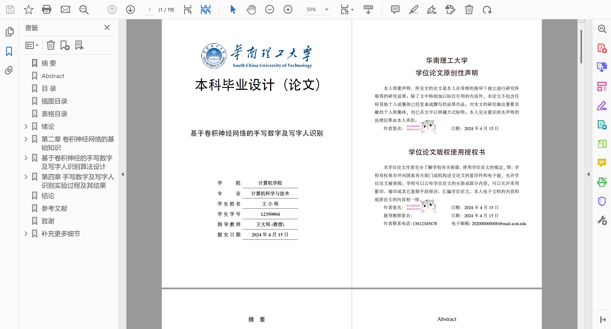

# 华南理工大学本科生 $\LaTeX$ 毕业论文模板


## 介绍
一个简单易用的华南理工大学本科生$\LaTeX$毕业论文模板。

<details>

<summary>考虑到本人毕业后（25年后）可能也不会持续维护此项目，点击此处介绍确定本模板和您届时范例区别的办法，您可以自行调整维护本repo中的latex模板来实现期望的功能。</summary>

1. 本repo参考的范例模板放在[specifications/](specifications)下，目前最新的版本是`附件2....20231010修订.doc`，经过验证，适用于至少2025年的毕业设计。如果您的毕业设计时间在2025年之后，您可以在[教务处](https://jw.scut.edu.cn/zhinan/cms/toPosts.do)中选择`实践`分类，并且搜索`毕业`字样，找寻类似于`关于认真做好xxx届本科毕业设计(论文)工作的通知`的条目，下载`管理办法及相关文件.rar`，在`工科撰写规范`下找到`附件2xxxx格式范例`。
2. 如果该文件的最后编辑时间小于等于24.5.8，您可以直接使用此repo；如果不是，请打开word，在搜索框中搜索`比较`功能，对新范例文件和本repo中参考的范例模板进行比较，确定差异。

> **前一位作者的话：** latex在根本上和word有很大差异，排版逻辑的不同，会导致在同一个规范下，和学校的word范例有所区别，比如1.5倍行距的问题，word如果定义了网格，并且勾选了跟随网格定义，那么这时候1.5倍行距是无效的，然而学校word模板很多地方都是这种操作，导致本模板会有不少地方行距（保证是1.5倍行距）和word范例（因为定义了网格，1.5倍行距不生效）不一样。因此本模板制作为latex学习参考。感谢支持。
此问题在本Repo [Issue1](https://github.com/frinkleko/SCUT-thesis/issues/1) 中有所进一步明确，欢迎讨论。
</details>

## 如何编译

### 使用`VSCode`编译
参考 [VSCode配置](https://github.com/shinyypig/latex-vscode-config) 配置`VSCode`环墶，使用`latex-workshop`插件编译。
### 使用`Overleaf`编译
请注意在使用Overleaf时，需要点击左上角的`menu`，将Compiler设置为`XeLaTeX`。其次，如果您遇到`Consolata`字体无法加载的问题，请在`scutthesis.cls`文件中将`\setmonofont{Consolata}`注释掉，转而在`main.tex`文件中使用`\usepackage{inconsolata}`。

<details>

<summary>使用texlive 编译</summary>

### 使用texlive 编译
本模板需要使用 `texlive(>=2020)` 进行编译，编译命令如下：

```shell
make pdf
```

即可生成 `main.pdf` 文件。

若不支持`makefile`可以使用命令

```shell
latexmk main.tex -shell-escape
```

编译需要 python 环境和`pygments`宏包用于代码高亮，若不需要代码环境请在`scutthesis.cls`文件中删除`minted`相关代码。

安装`texlive`后部分系统需要安装`perl`依赖

```shell
dnf install -y python3-pip perl fontconfig-devel perl-YAML-Tiny
pip3 install pygments
```

windows 用户可直接执行

```bat
pip install pygments
```
</details>

### 其他
注：由于`newtext`宏包的原因，不支持 Github Action 在线编译

## 开始使用

### 个人信息

23.10.10 规范中学校教务处模板中添加了学位论文原创性声明和论文版权使用授权书，同时更改了封面的布局版式。因此在使用本模板时需要填写相关信息。除了封面页的个人信息外，请参照下列指示在`docs/info.tex`中填写个人信息。


1. 可以使用`\makedisclaim[签名.png]`来指定签名图片，如果需要设置图片的位置详见`scutthesis.cls`文件中 384 行
    ```latex
    \begin{textblock}{5}(3.8,6.1) % 指定图片的位置和大小
        \includegraphics[height=2cm]{#1}
    \end{textblock}
    ```
2. 由于版权使用授权书需要手机号码和邮箱，请在`docs/info.tex`中加上这两行，不是的话可能编译失败
    ```diff
    \cmajor{计算机科学与技术}
    \emajor{Computer Science and Technology}
    +\phonenum{13612345678}
    +\mailbox{202000000000@mail.scut.edu}
    % 指导老师
    \cmentor{王大明 \ (教授)}
    ```

### 模板内部结构
参考`main.tex`文件，章节被放置在`docs`文件夹下，每个章节都是一个单独的`.tex`文件，通过`\input{}`命令引入。

### 模板内Latex命令演示
请参考[command_example.md](./github_docs/command_exmaple.md)。

### 学校关于毕业设计的相关规范
请参考[related_regulations.md](/github_docs/related_regulations.md)。

## 参考
本项目借用中山大学[Lovely-XPP/SYSU-thesis](https://github.com/Lovely-XPP/SYSU-thesis) 模板定义，重新构建了`scutthesis.cls`模板文件。
本Repo原作者为[ShevonKuan](https://github.com/ShevonKuan)。